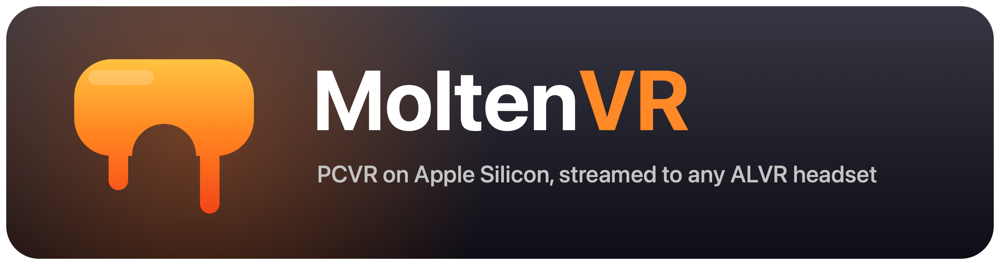

  

  
  
  
  

**Play PCVR games on your Apple Silicon Mac, streamed to your headset - over USB or Wi-Fi.**

Windows VR games run under Wine with D3D11 translated to Metal, a custom OpenXR runtime
captures every frame, and hardware H.264 streams it to the stock ALVR client on your headset -
with full 6DoF tracking, controllers, haptics, and game audio coming back the other way.

> **Free 7-day preview.** Everything works for one week from first launch. To keep going, enter a
> license key in the app to unlock the latest version - support me on **Patreon (coming soon)** to
> get your key. New preview releases also reset the window.

### Features

* **USB streaming** - 100 Mbps H.264 over the cable; no Wi-Fi jitter. (Wi-Fi works too.)
* **Low-latency pipeline** - hardware encode in frame-in/frame-out mode, 72 fps.
* **Full input** - 6DoF head + controllers, buttons, thumbsticks, and haptics.
* **Desktop view** - double-tap the menu button in VR to see your Mac desktop.
* **Game audio** - routed into the stream via BlackHole.
* **Setup wizard + management app** - bottle setup (Whisky / CrossOver / Wineskin), automatic
  game detection (Steam, BSManager multi-version, itch.io), one-click patching, live stats.

### Verified games

| Game | Source | Engine |
|------|--------|--------|
| Beat Saber 1.44.1 | Steam | Unity 6 |
| Beat Saber 1.40.8 (modded, BSIPA) | BSManager | Unity 2022.3 |
| Iron Lung VR | itch.io | Unity |
| Minecraft + Vivecraft | Prism | native (no Wine!) |

Other Unity OpenXR/OpenVR titles may work - try yours and open an issue with the result.

### Requirements

* Apple Silicon Mac, macOS 14+
* A headset running the [ALVR client](https://github.com/alvr-org/ALVR/releases/tag/v20.14.0) (v20.14.0)
* A Wine environment with your games in it - [Whisky](https://getwhisky.app) recommended
* For USB streaming: `brew install android-platform-tools`
* For game audio: `brew install --cask blackhole-2ch && brew install switchaudio-osx`

### Install

1. Download `MoltenVR-Preview-vX.Y.Z.zip` from [Releases](../../releases), unzip, and drag
   **MoltenVR Preview.app** to `/Applications`.
2. Open it - the setup wizard checks your system, sets up your Wine bottle (graphics layer +
   VR runtime install are one click each), and walks you to your first stream.
3. Press **Start Stream**, put the headset on, open the ALVR app, and launch a game from the
   **Games** screen.

> macOS will ask for Screen Recording (desktop view) and Microphone (game audio) permissions
> the first time those features are used - grant both.
> The app is not notarized yet: right-click → Open on first launch.

### FAQ

***Is this SteamVR for Mac?***
No - SteamVR doesn't run on macOS. MoltenVR is its own OpenXR runtime + streaming stack,
reusing ALVR's battle-tested transport and headset client.

***A game launches flat (not in VR)?***
Open an issue with the game name - unsupported games usually just need one more OpenXR
extension advertised, which is a small fix.

***What happens after the 7 days?***
The app asks for a license key. Enter one (from Patreon) to unlock the latest version on this
Mac - or grab a fresh preview release here, which resets the window.

***Does Minecraft really run in VR on a Mac?***
Yes - via Vivecraft, fully native (no Wine). It's the first working Mac Minecraft VR since
SteamVR for Mac was discontinued in 2020.

### Credits

* [ALVR](https://github.com/alvr-org/ALVR) - streaming core and headset client
* [DXMT](https://github.com/3Shain/dxmt) - D3D11 → Metal translation
* [Whisky](https://getwhisky.app) - Wine distribution for macOS
* [BlackHole](https://github.com/ExistentialAudio/BlackHole) - audio loopback driver

---

© Toby Fox. Preview build - all rights reserved. Binaries only; source not included.

